# 지역 특성에 기반한 2030핫플레이스 예측:요인과 분류 분석
기간 : 23.12.11~24.01.03

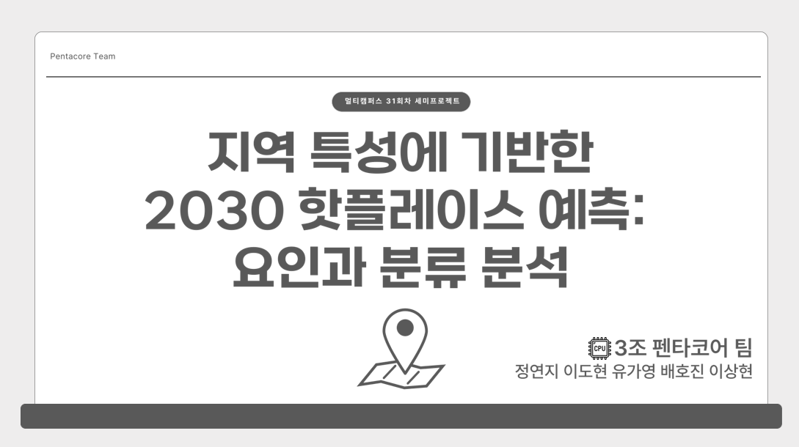

# 1. 팀 소개

조장 : 정연지 
팀원 : 이도현, 이상현, 유가영, 배호진

# 2. 프로젝트 목적

- 시간단위별 유동인구 데이터를 활용한 지역별 매출 예측

# 3. 프로젝트 서론

- 2030 핫플레이스 요인과 분류 분석을 통해 유행에 민감한 트렌드세터들에게 정보를 제공하고 소상공인에게 유용한 상권정보 제공을 통해 상권 활성화 방안 모색 과정에 활용

# 4. 데이터 크롤링

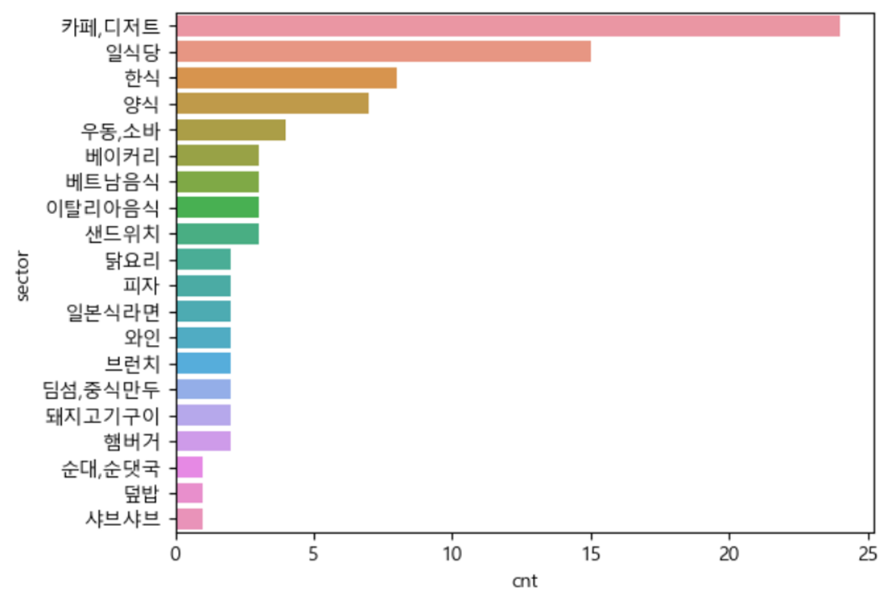

- 현황을 파악하기 위해 SNS 데이터 크롤링을 통해서 핫플과 관련된 요인 추측
- 2030 핫플레이스는 카페와 관련된 트렌드에 영향을 받고 있음을 알 수 있음

# 6. EDA

## 1) 서비스 업종별 매출금액 파악

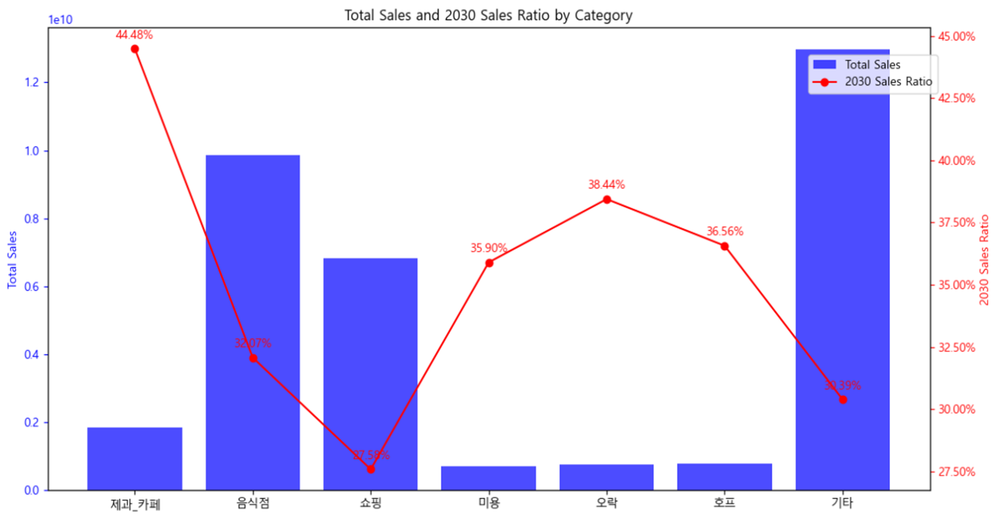

- 기타 항목을 제외하고 음식점, 제과/카페 업종이 전체 매출에서 큰 부분을 차지
- 각 업종에서 2030세대의 매출 비율을 통해 어떤 업종이 2030세대들에게 주목받을 수 있는지 살펴볼 수 있음

## 2) 시간대별 요인별 평균 매출 분포 파악

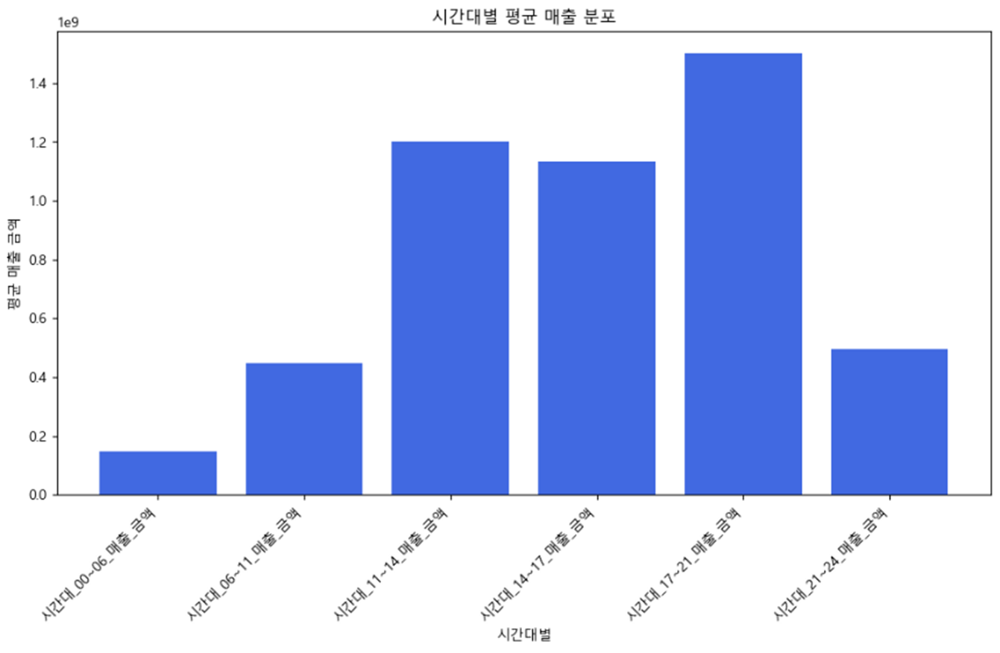
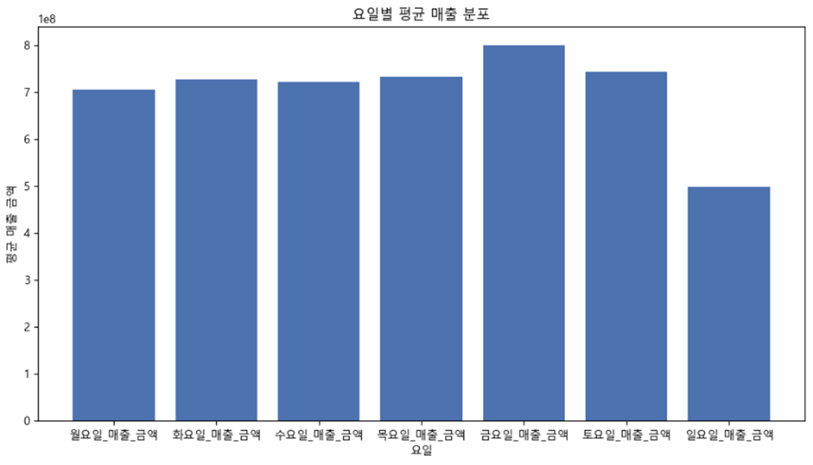

- 17~21시 시간대, 금요일과 토요일에 매출금액이 높다는 것을 알 수 있음

## 3) 유동인구 특성 파악
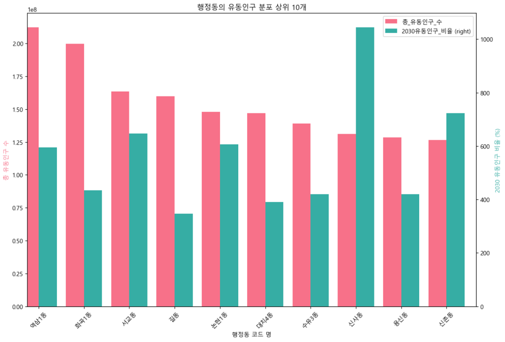

- 행정동별 유동인구의 상위 10개 행정동 시각화 결과, 행정동의 특성에 따라 2030 유동인구 비율이 상이함을 확인
- 각 행정동의 독특한 특성이 2030 유동인구 비율에 영향을 미치고 있음을 시사

## 4) 2030 매출 특성 파악
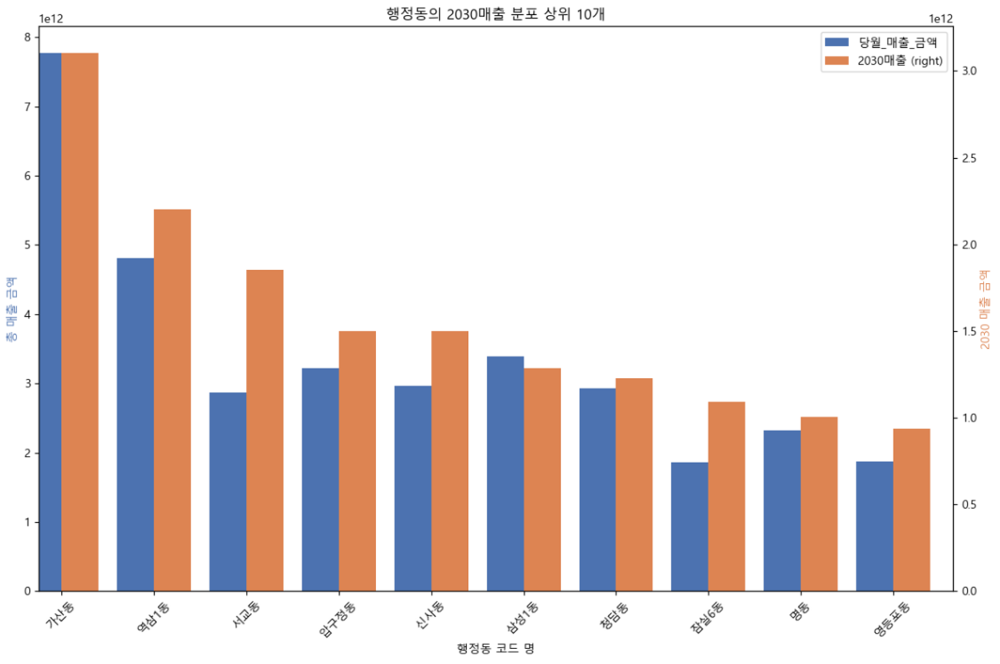

- 행정동의 특성에 따라 2030 매출금액이 상이함 확인 및 매출금액에 영향을 미치고 있음을 시사

## 5) 2030 제과/카페 업종 매출금액 파악
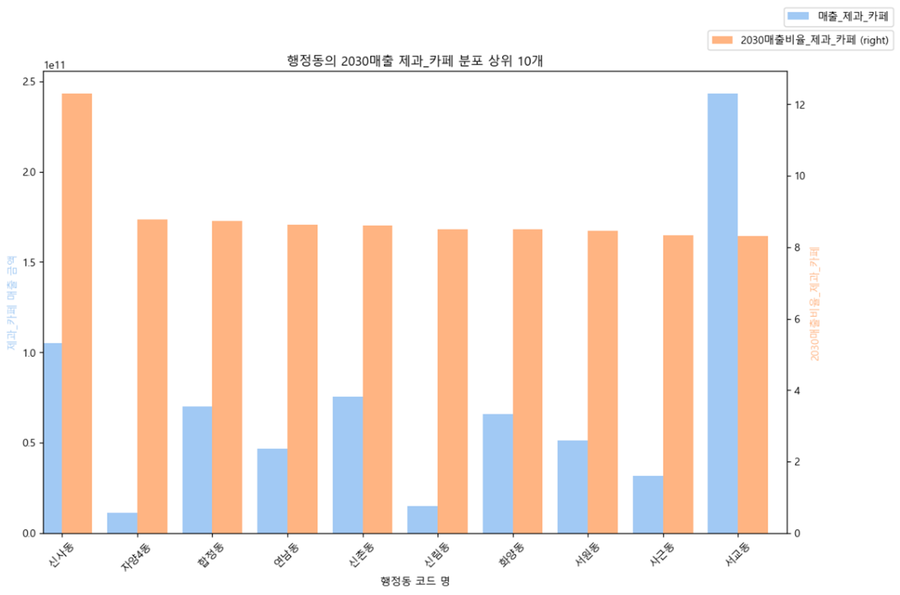

- 행정동의 특성에 따라 제과/카페 업종의 2030 매출금액이 상이함 확인 및 매출금액에 영향을 미치고 있음을 사사

서울시 행정동 426개 중 서울시에서 핫플레이스라고 정의된 72개 행정동을 선정 
핫플레이스 행정동을 1로, 나머지 행정동은 0으로 '핫플'이라는 파생변수 생성

## 6) 핫플레이스 지역과 교통 시설 관계

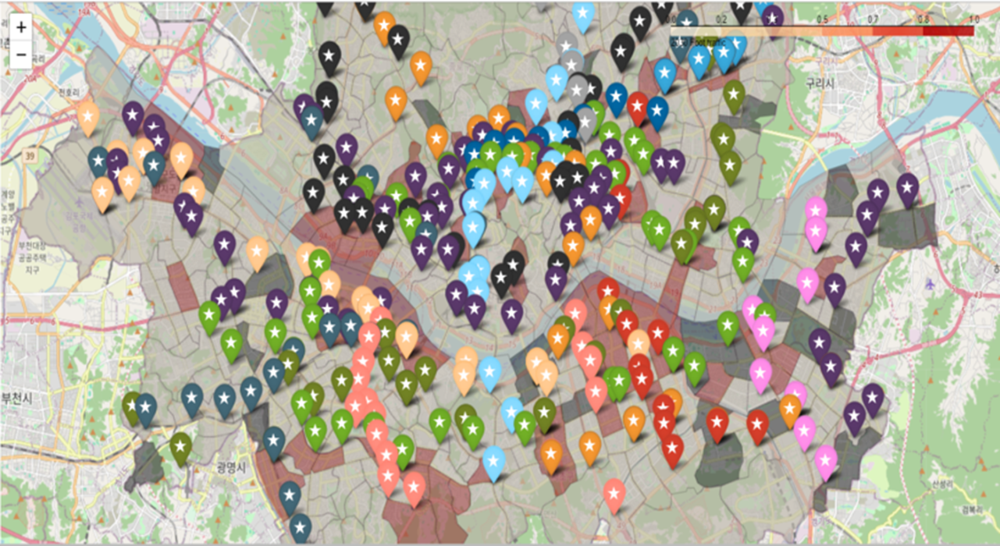
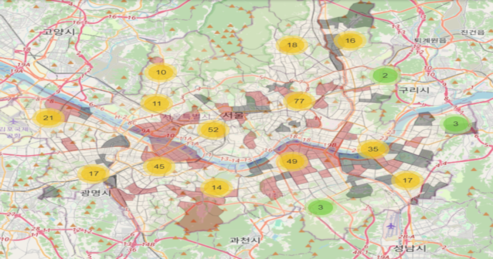

핫플레이스로 분류된 지역에는 많은 역이 분포 및 밀집되어 있고 접근이 용이

# 7. 상관성 분석

- 독립변수 : 핫플
- 종속변수 : 행정동, 핫플을 제외한 나머지 컬럼
- 핫플레이스와 높은 상관성을 보이는 요인

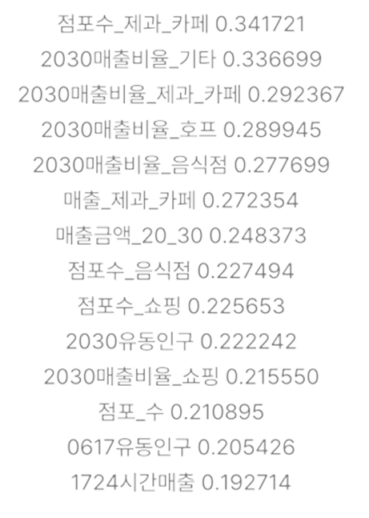

- 2030 매출금액과 높은 상관성을 보이는 요인

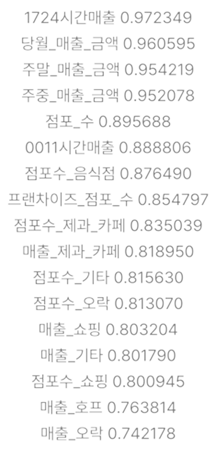

# 8. K-means

- 상관성이 상대적으로 높은 요인들을 추출
- StandardScaler을 통해서 변수 간 거리를 동등하게 만들어주어 모델의 성능을 향상

## 1) PCA
  

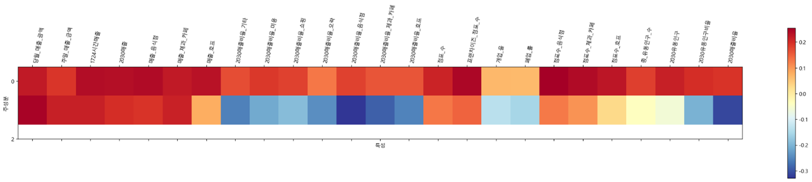

  
## 2) Silhouette Score

최적 군집수 탐색

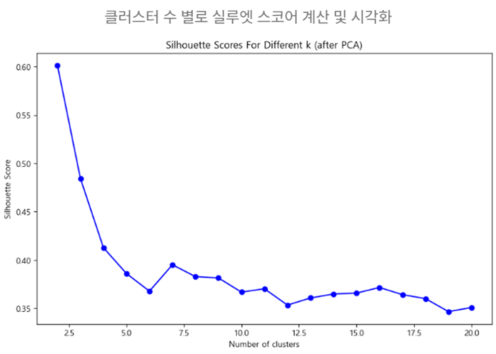
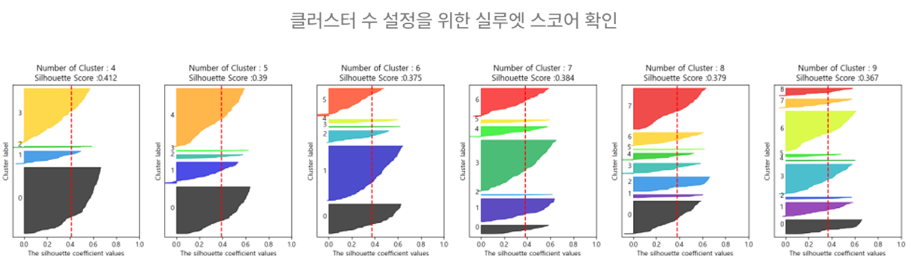

- 효율적으로 잘 분리 됐다는 것은 다른 군집과의 거리는 떨어져있고 동일 군집끼리의 데이터는 서로 가깝게 잘 뭉쳤다는 것을 의미
- 전체 Silhoutette Score의 평균값과 더불어 개별 군집의 평균값의 편차가 크지 않아야하며 전체 Silhoutette Score의 평균값은 높지만 특정 군집의 Silhoutette Score 평균값만 유난히 높고 다른 군집들의 Silhoutette Score평균값은 낮으면 좋은 군집화 조건은 아님
- Silhoutette Score 결과 군집수는 7로 선정

## 3) 군집화

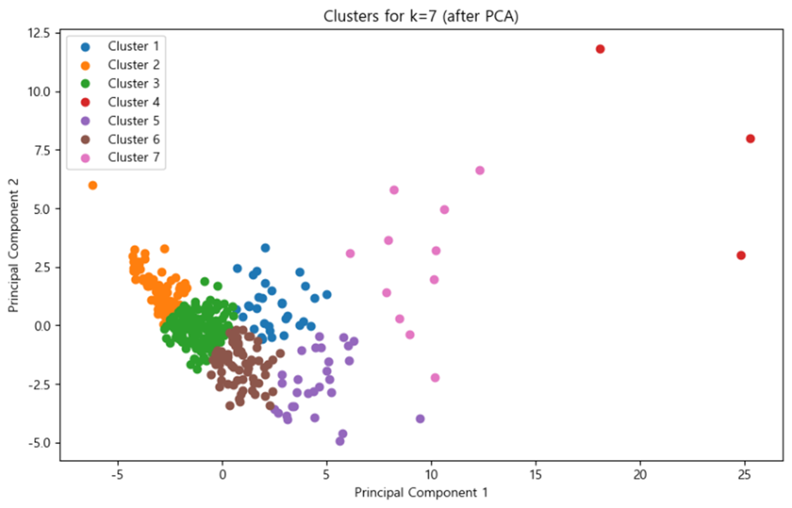

### 핫플 X

- Cluster1: 32개
- Cluster2: 79개 
- Cluster3: 168개
- Cluster6: 68개

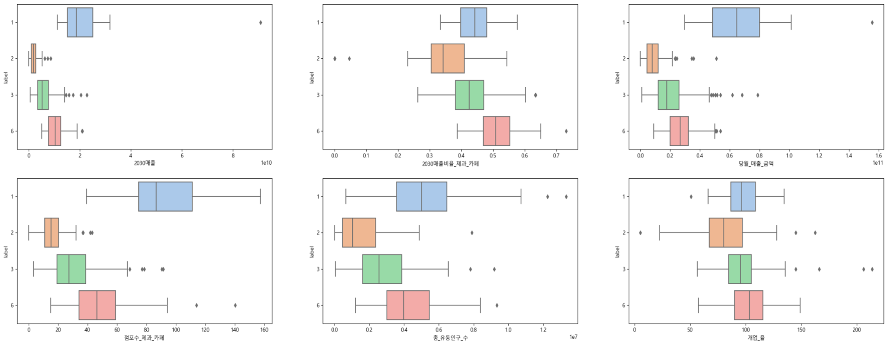

중소 규모의 고급 상업 시설과 예술적인 분위기, 조용하면서 자연과 역사를 즐길 수 있는 주거 지역, 다채로운 상권

### 핫플 O

- Cluster4: 3개
  다양한 상권과 문화 시설이 혼합된 지역으로 다양한 인구층이 활동하는 도심지
- Cluster5: 29개
  대학교, 예술 공연장 등이 밀집된 지역으로 학문과 문화가 활발
  다양한 상업 시설과 엔터테인먼트, 음식 문화가 혼재한 20대와 30대를 위한 활발한 지역
- Cluster7: 11개
  예술 갤러리, 디자이너 샵, 트렌디한 카페, 고급 상권과 외국인 관광객들이 많은 지역

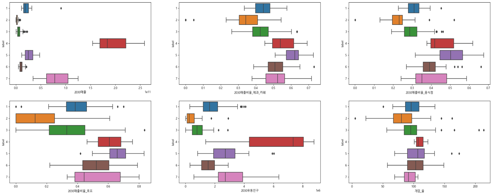

2030 매출(제과/카페, 음식점, 호프)이 높고, 2030 유동인구가 많음
다양한 맛과 음식 경험을 즐길 수 있고 예술적인 분위기가 풍부하며 다양한 활동이 가능

K-means 결과를 통해 클러스터 그룹에 해당하는 `Cluster`라는 파생변수 생성 

# 9. XGBoost

## 1) 목적

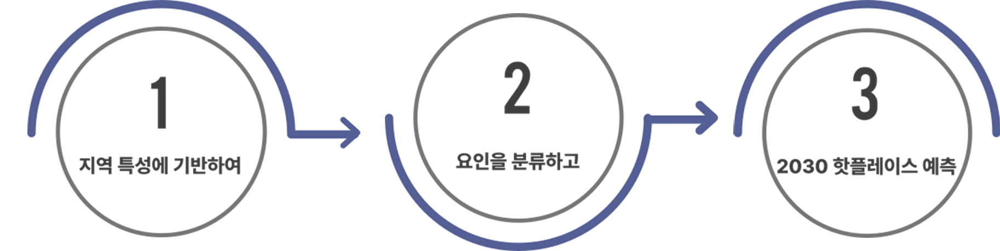

- 앞서 지역 특성에 기반한 EDA와 요인 분류를 위한 K-means 수행
- 이를 바탕으로 2030 핫플레이스 행정동 예측

## 2) 해당 모델 사용 이유

- 규제를 통한 과적합 방지
- 피처 중요도 제공
- 상호작용 고려
- 데이터 불안정성 보완

## 3) 사용 feature

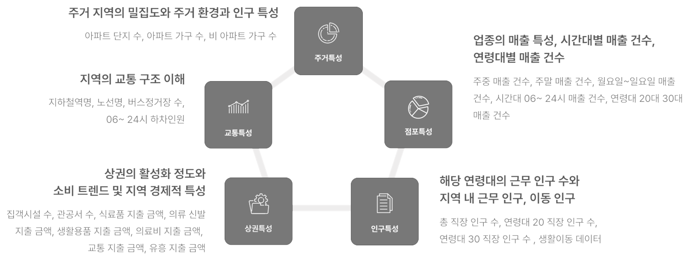

## 4)  모델 결과

### (1) 모델 Accuracy

- Train Accuracy : 0.972
- Test Accuracy : 0.971

### (2) Confusion Matrix

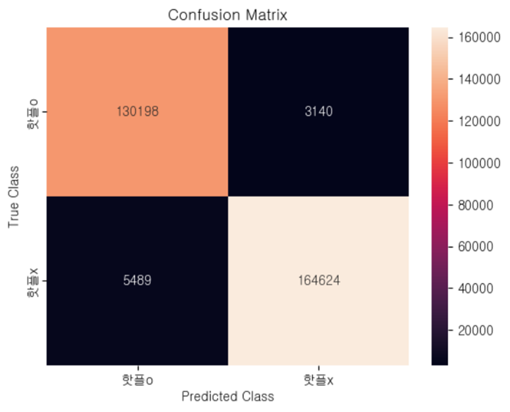

### (3) Feature Importance

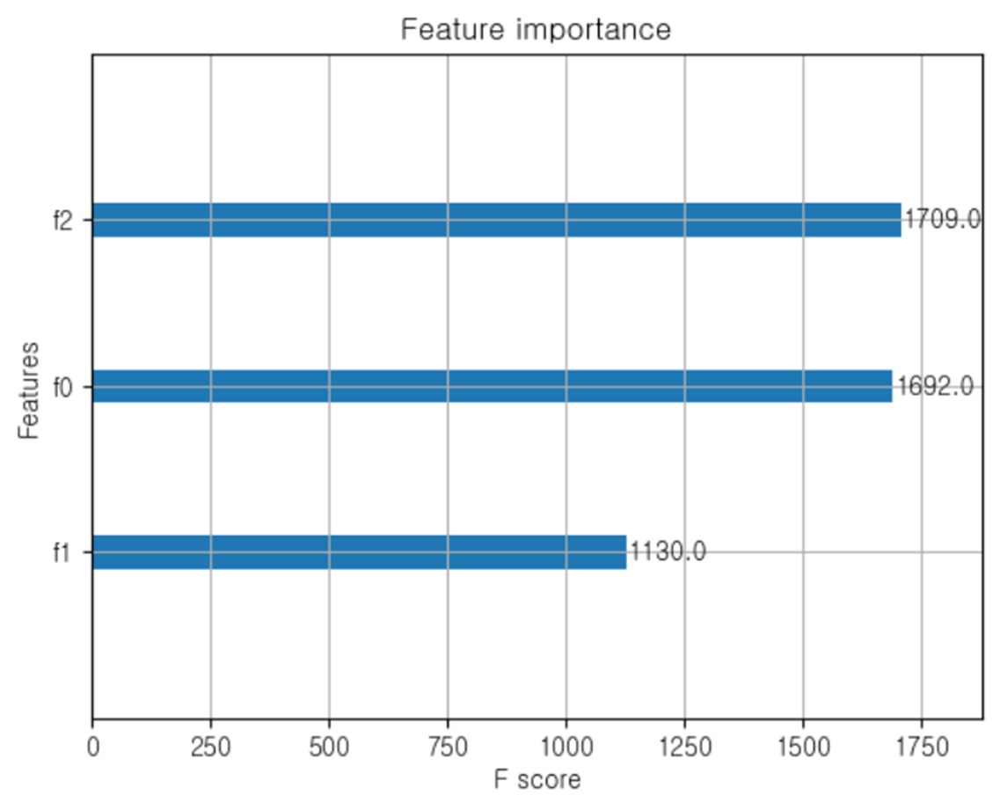
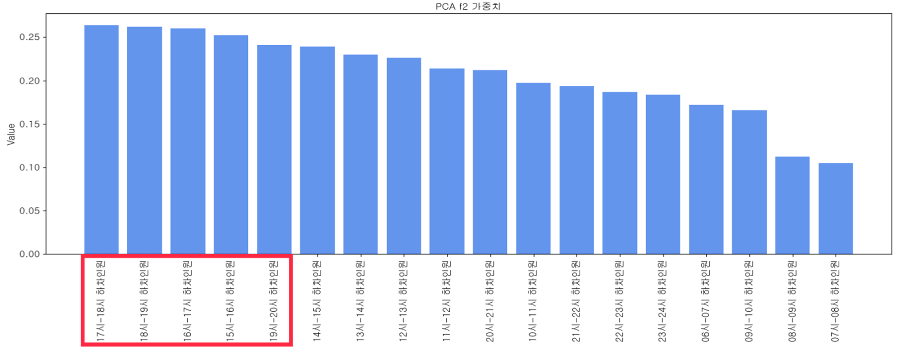
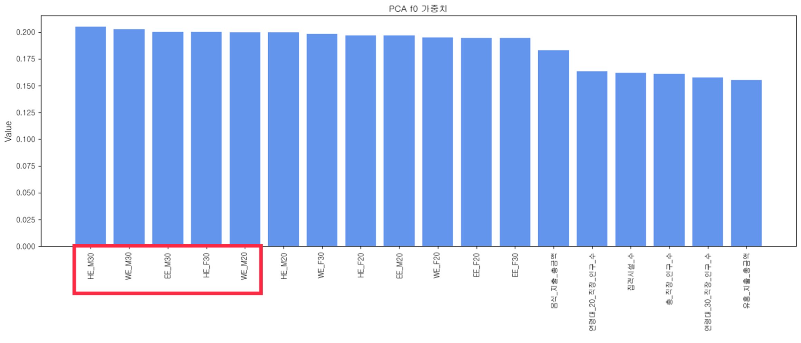
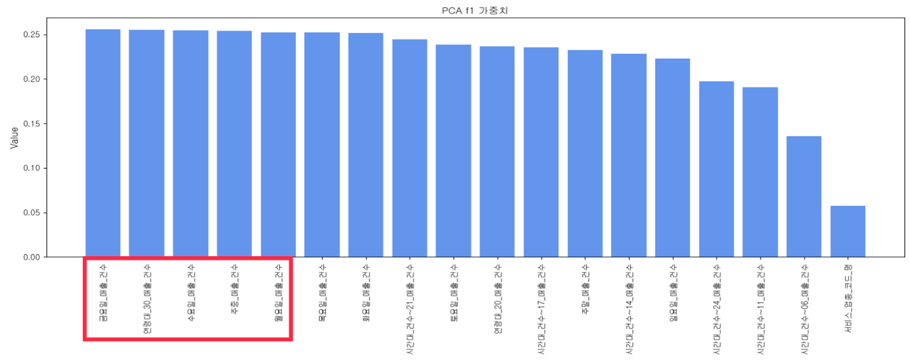

하차인원, 기타지역(E, 상주지가 아닌 지역), 금요일 매출 건수, 30대 매출 건수 등에서 가중치의 부여 확인

:point_right: [노션](https://www.notion.so/2030-c547af91595a425daf52adb2dca95a43?pvs=4) 자세한 내용
